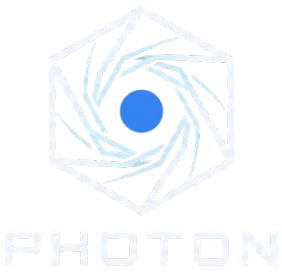

<div align="center">
  
</div>

<p align="center"><strong>AI-Powered Image Processing</strong></p>

Photon is an autonomous, natural-language image processing studio. Upload any image, describe how you want it transformed in plain English, and watch the AI write, execute, and self-correct the required Python code in real-time to deliver the result.

## Features

- **Conversational Processing**: Chat with your images. Ask for edge detection, color manipulation, or complex scientific filters, and the integrated LLM handles the implementation.
- **Autonomous Execution Loop**: Photon writes Python, runs it in a secure sandbox, analyzes the output, and automatically fixes errors—up to 6 self-correction attempts per prompt.
- **Batch Processing Support**: Apply the same transformation pipeline across multiple images simultaneously with a single prompt.
- **Universal Format Support**: Works flawlessly with standard RGB/RGBA formats, grayscale, and even float32 multispectral `.npy` arrays.
- **Manual Mode**: Need exact control? Drop into the built-in code editor to write or tweak the Python execution script yourself.
- **Visual Version Control**: Interactive carousels, side-by-side comparisons, and filmstrips make it easy to track every iteration of your image.
- **Export Ready**: Download your selected full-resolution outputs packaged in a neat ZIP archive.

## Quick Start

### Option A: Docker (Recommended)

1. **Configure Environment**
   ```bash
   cp .env.example .env
   ```
   Edit `.env` to select your preferred LLM provider (`gemini` or `openai`) and insert your API key.

2. **Run with Docker Compose**
   ```bash
   docker-compose -f docker/docker-compose.yml up --build -d
   ```
   *Photon is now running! Open `http://localhost:5050` in your browser.*

### Option B: Local Setup

**1. Install Dependencies**
```bash
uv sync
npm install
```

**2. Configure Environment**
```bash
cp .env.example .env
```
Edit `.env` to select your preferred LLM provider (`gemini` or `openai`) and insert your API key. (Supports Google Gemini SDK, official OpenAI, or any OpenAI-compatible endpoint like Ollama or Groq).

**3. Build UI Assets**
```bash
npm run build:css
```

**4. Launch Photon**
```bash
uv run src/backend/wsgi.py
```
*Alternatively:* `flask --app src/backend/app run --debug`

Open `http://localhost:5000` in your browser.

## The Execution Contract

Whether you are using manual mode or observing the AI, Photon relies on a strict execution contract for the sandbox:

```python
def main(input_path: str, output_path_dir: str) -> str:
    """Read input_path, transform, save result into output_path_dir, return full saved path."""
    ...
```
*(You can view example code from within the application interface.)*

## License

This product is released under the [MIT License](LICENSE).
